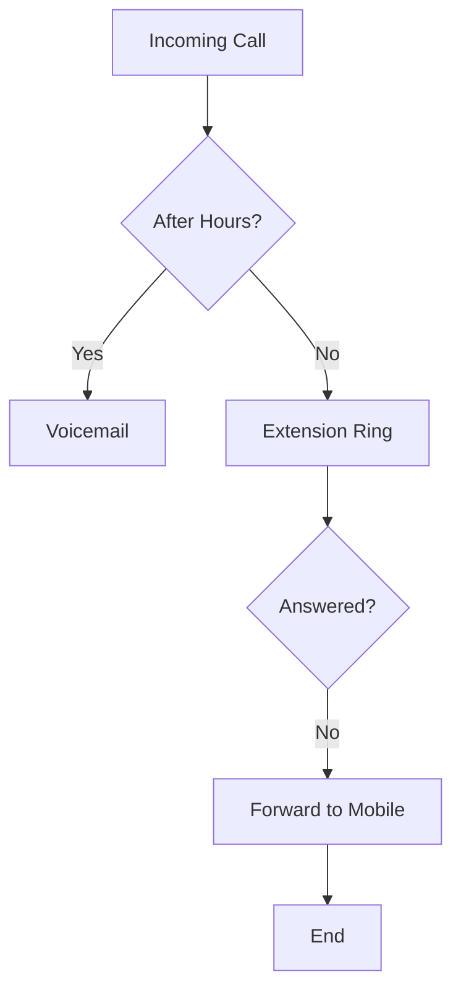

## Overview

Customize your Euphoria Telecom VoIP system to match your business operations. Configure business hours, caller ID, voicemail, extensions, call forwarding, and contact center integrations through the dashboard or API.

<Callout kind="info">
Use the dashboard at `https://dashboard.example.com` for quick visual setup, or the API at `https://api.example.com` for automation and advanced control.
</Callout>

<Columns cols={3}>
  <Card title="Business Hours" icon="clock" href="#business-hours">
    Set availability and after-hours handling.
  </Card>
  <Card title="Voicemail" icon="phone" href="#voicemail">
    Record custom greetings and manage messages.
  </Card>
  <Card title="Extensions" icon="users" href="#extensions">
    Assign numbers to team members.
  </Card>
</Columns>

## Setting Business Hours and Caller ID

Define when your system accepts calls and set a custom caller ID.

<Tabs>
  <Tab title="Dashboard" icon="monitor">
    <Steps>
      <Step title="Access Settings" icon="settings">
        Navigate to **System > Business Hours** in the dashboard.
      </Step>
      <Step title="Set Schedule" icon="calendar">
        Add time zones and rules, e.g., Monday-Friday 9 AM-5 PM.
      </Step>
      <Step title="Update Caller ID" icon="phone">
        Enter your business number or name in the Caller ID field.
      </Step>
    </Steps>
  </Tab>
  <Tab title="API" icon="code">
    ```javascript
    const response = await fetch('https://api.example.com/v1/business-hours', {
      method: 'PUT',
      headers: { 'Authorization': 'Bearer YOUR_TOKEN', 'Content-Type': 'application/json' },
      body: JSON.stringify({
        enabled: true,
        schedule: [
          { day: 'monday', start: '09:00', end: '17:00' }
        ],
        callerId: '+27123456789'
      })
    });
    ```
  </Tab>
</Tabs>

<ParamField path="callerId" param-type="string" required="true">
Your outbound caller ID number or name.
</ParamField>

<ParamField path="schedule" param-type="array" required="false">
Array of daily schedules with `day`, `start`, `end`.
</ParamField>

## Customizing Voicemail Greetings

Upload audio files or use text-to-speech for personalized greetings.

<CodeGroup tabs="Upload,Text-to-Speech">
  ```javascript
  // Upload audio file
  const formData = new FormData();
  formData.append('greeting', audioFile);
  await fetch('https://api.example.com/v1/voicemail/greeting', {
    method: 'POST',
    headers: { 'Authorization': 'Bearer YOUR_TOKEN' },
    body: formData
  });
  ```
  ```javascript
  // Text-to-speech
  await fetch('https://api.example.com/v1/voicemail/greeting/tts', {
    method: 'POST',
    headers: { 'Authorization': 'Bearer YOUR_TOKEN', 'Content-Type': 'application/json' },
    body: JSON.stringify({
      text: 'Welcome to Euphoria Telecom. Please leave a message.',
      voice: 'female'
    })
  });
  ```
</CodeGroup>

## Managing Phone Number Extensions

Assign extensions to users or departments.

| Extension | User/Department | Status |
|-----------|-----------------|--------|
| 100       | Sales Team      | Active |
| 101       | Support         | Active |
| 200       | Manager         | Active |

Use the API to create extensions:

````jsx
<Request show-lines="true">
```javascript
POST https://api.example.com/v1/extensions
Authorization: Bearer YOUR_TOKEN

{
  "extension": "102",
  "userId": "user-123",
  "forwardTo": "+27821234567"
}
```
</Request>
````

<ParamField path="extension" param-type="string" required="true">
Four-digit extension number.
</ParamField>

## Configuring Call Forwarding Rules

Set rules to route calls dynamically.



<Expandable title="Advanced Rules" default-open="false">

Configure complex rules via API:

```javascript
await fetch('https://api.example.com/v1/forwarding', {
  method: 'POST',
  body: JSON.stringify({
    rules: [
      { condition: 'busy', action: 'forward', target: '+27821234567' }
    ]
  })
});
```

</Expandable>

## Integrating with Contact Center Workflows

Link your VoIP setup to contact center tools for agent monitoring and AI summaries.

<Callout kind="tip">
Enable webhooks at `https://api.example.com/v1/webhooks` to send call data to your CRM.
</Callout>

| Integration | Endpoint | Purpose |
|-------------|----------|---------|
| CRM Sync    | POST /calls | Log call details |
| AI Notes    | POST /summaries | Auto-generate notes |

<Steps>
  <Step title="Add Webhook" icon="link">
    In dashboard, go to **Integrations > Webhooks**.
  </Step>
  <Step title="Test Endpoint" icon="play">
    Use `https://your-webhook-url.com/webhook` as target.
  </Step>
</Steps>