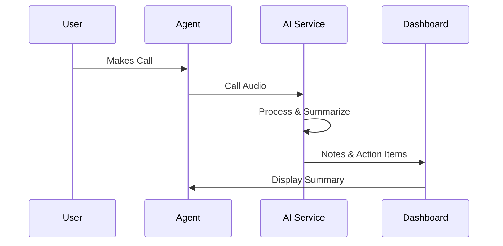

## Overview

Euphoria Telecom delivers a contract-free VoIP phone system designed for businesses and contact centers. You gain access to powerful tools that enhance call handling, agent productivity, and customer satisfaction. Core features include AI-driven note capture, custom call routing, real-time monitoring, performance analytics, and customer experience reporting.

These capabilities integrate seamlessly into your workflows, providing actionable insights without complex setups.

<Callout kind="info">
Enable these features through your dashboard at `https://dashboard.example.com` to start optimizing communications immediately.
</Callout>

## Key Features

Discover the essential tools that set Euphoria Telecom apart.

<Columns cols={3}>
  <Card title="AI Note Capture" icon="zap" href="#ai-notes">
    Automatically generate call summaries, action items, and next steps using AI.
  </Card>
  <Card title="Custom Call Routing" icon="settings" href="#call-routing">
    Build interactive voice menus to route calls efficiently.
  </Card>
  <Card title="Real-Time Monitoring" icon="monitor" href="#monitoring">
    Train agents with live call oversight and whisper coaching.
  </Card>
  <Card title="Agent Analytics" icon="bar-chart-3" href="#analytics">
    Track performance metrics and call trends in real time.
  </Card>
  <Card title="Customer Reporting" icon="users" href="#reporting" horizontal>
    Measure satisfaction and experience with detailed reports.
  </Card>
</Columns>

## AI Note Capture and Summaries

Leverage AI to transcribe calls and extract key insights automatically.



<Tabs>
  <Tab title="Dashboard View" icon="monitor">
    Access summaries directly in your agent interface.

    <Image
      src="https://euphoria.co.za/wp-content/uploads/2024/06/ai-notes-example.jpg"
      alt="AI-generated call summary in dashboard"
      width="800"
      height="400"
    />
  </Tab>
  <Tab title="API Integration" icon="code">
    Fetch AI insights programmatically.

    <Request tabs="JavaScript,cURL">
````javascript
const response = await fetch('https://api.example.com/v1/calls/{callId}/ai-summary', {
  headers: {
    'Authorization': 'Bearer YOUR_API_KEY'
  }
});
const summary = await response.json();
````
````bash
curl -H "Authorization: Bearer YOUR_API_KEY" \
  https://api.example.com/v1/calls/{callId}/ai-summary
````
    </Request>
  </Tab>
</Tabs>

## Custom Call Routing and Menus

Design IVR menus to direct callers to the right agents or departments.

<Steps>
  <Step title="Create Menu" icon="plus">
    Navigate to Routing in your dashboard and add a new menu.
  </Step>
  <Step title="Add Prompts" icon="upload">
    Upload audio files or use text-to-speech for greetings.
  </Step>
  <Step title="Set Rules" icon="settings">
    Define keypress options (e.g., 1 for sales, 2 for support).
  </Step>
  <Step title="Test & Deploy" icon="play">
    Preview the flow and activate it.
  </Step>
</Steps>

<ParamField path="menuId" param-type="string" required="true">
  Unique identifier for your IVR menu.
</ParamField>

<ParamField body="prompt" param-type="string" required="false">
  Custom voice prompt text.
</ParamField>

## Real-Time Call Monitoring and Training

Monitor live calls to coach agents and ensure quality.

<Expandable title="Advanced Monitoring Options" default-open="false">
Use whisper mode to provide real-time guidance without caller awareness.

<CodeGroup tabs="Configuration">
````json
{
  "monitor": {
    "enabled": true,
    "whisper": true,
    "record": true
  }
}
````
</CodeGroup>
</Expandable>

## Performance Analytics and Reporting

Track agent metrics and call trends with intuitive dashboards.

| Metric | Description | Target |
|--------|-------------|--------|
| Average Handle Time | Time per call | `<5min` |
| First Call Resolution | Issues solved on first contact | `>80%` |
| Call Volume Trends | Daily/weekly patterns | N/A |

<Response tabs="Success,Error">
````json
{
  "agentId": "agt_123",
  "avgHandleTime": 240,
  "fcrRate": 0.85,
  "trends": {
    "peakHour": "14:00",
    "volume": 150
  }
}
````
````json
{
  "error": "Insufficient permissions",
  "code": 403
}
````
</Response>

<Callout kind="tip">
Integrate reports into your BI tools via webhooks at `https://your-webhook-url.com/webhook` for automated analysis.
</Callout>

## Get Started with Features

Combine these tools for a complete contact center solution. Start by enabling AI summaries in your settings, then build your first IVR menu.

<Columns cols={2}>
  <Card title="Quickstart Guide" icon="rocket" href="/quickstart">
    Set up in minutes.
  </Card>
  <Card title="API Reference" icon="book-open" href="/authentication">
    Integrate programmatically.
  </Card>
</Columns>